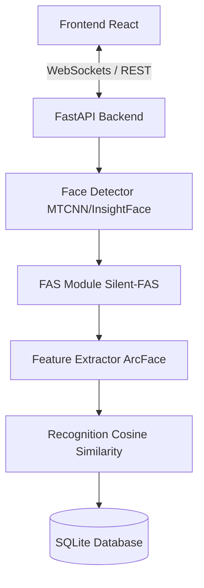

# 🛡️ Face Auth & Secure Check-in System (Advanced FAS Edition)

A modern face recognition and authentication system integrated with **Face Anti-Spoofing (FAS)** technology to ensure maximum security and accuracy. This project provides a complete Full-stack solution, from an AI-powered Backend to an intuitive Frontend Dashboard.

---

## 🚀 Key Features

*   **🛡️ Face Anti-Spoofing (FAS):** Integrated with **Silent-Face-Anti-Spoofing** (MiniFASNet). Detects and rejects spoofing attempts using photos, videos, or masks in real-time.
*   **👤 Accurate Face Recognition:** Powered by **InsightFace (ArcFace)** with the `buffalo_l` model, ensuring high precision even in varying lighting conditions.
*   **⚡ Live Stream Processing:** Processes video streams via **WebSockets**, supporting real-time bounding box overlays and user information display with ultra-low latency.
*   **🔐 Auth & User Management:**
    *   **Enrollment:** Secure registration for new users with face sample collection (requires liveness check).
    *   **Secure Check-in:** A dedicated check-in mode that performs simultaneous face recognition and liveness detection.
*   **📊 Dashboard & History:** Logs all check-in events with image evidence stored in the `data/evidence` directory.

---

## 🏗️ System Architecture



---

## 🛠️ Tech Stack

| Component | Technology |
| :--- | :--- |
| **Backend** | FastAPI, Python 3.10+, Uvicorn |
| **AI Models** | InsightFace, OpenCV, ONNX Runtime, Silent-FAS |
| **Database** | SQLite, aiosqlite (Async wrapper) |
| **Frontend** | ReactJS, Vite, TailwindCSS, Lucide Icons |
| **Communication** | REST API, WebSockets |

---

## ⚙️ Installation & Setup

### 1. System Requirements
*   **OS:** Linux (Ubuntu recommended) / Windows / macOS.
*   **Python:** 3.8 - 3.12.
*   **Node.js:** v18+.
*   **Hardware:** Minimum 4GB RAM. NVIDIA GPU (CUDA) recommended for optimal performance.

### 2. Backend Setup
```bash
git clone <repository_url>
cd detection-face

# Create virtual environment
python3 -m venv venv
source venv/bin/activate  # Linux/Mac
# venv\Scripts\activate   # Windows

# Install dependencies
pip install -r requirements.txt
```

### 3. Frontend Setup
```bash
cd frontend
npm install
```

### 4. Running the Services
Start both Backend and Frontend servers simultaneously:

**Terminal 1 (Backend):**
```bash
source venv/bin/activate
uvicorn main:app --host 0.0.0.0 --port 8000 --reload
```

**Terminal 2 (Frontend):**
```bash
cd frontend
npm run dev -- --port 3000
```

---

## 📡 Key API Endpoints

| Method | Endpoint | Description |
| :--- | :--- | :--- |
| `POST` | `/api/v1/auth/register` | Register new user + Face enrollment |
| `POST` | `/api/v1/auth/login` | System authentication |
| `POST` | `/api/v1/checkin_fas` | Secure check-in (Recognition + FAS) |
| `GET` | `/api/v1/history` | Fetch check-in history |
| `GET` | `/docs` | Interactive Swagger UI documentation |

---

## 🔧 Advanced Configuration (`config.py`)

Customize system behavior in `config.py`:
*   `RECOGNITION_THRESHOLD`: Recognition sensitivity (default `0.5`).
*   `FAS_THRESHOLD`: Anti-spoofing threshold (default `0.9`).
*   `DEVICE`: Toggle between `cpu` and `cuda`.

---

## ❓ Troubleshooting

> [!IMPORTANT]
> **Camera Issues:** Ensure the browser has camera permissions and no other application is currently using the camera.

> [!TIP]
> **Performance:** If running on CPU, consider reducing frame size or using lite models located in the `models/` directory.

> [!WARNING]
> **FAS Rejections:** If real faces are frequently rejected, check lighting conditions (avoid backlighting) and ensure the user is 40-60cm away from the camera.

---

## 📂 Directory Structure

```text
/detection-face
├── api/                # Endpoints, Schemas, and Business Logic
├── models/             # Core AI (Detector, Recognizer, FAS Module)
├── streaming/          # WebSocket Stream Processor
├── data/               # Persistent Storage (DB and Evidence images)
├── frontend/           # React Frontend Source Code
├── libs/               # Supporting Libraries & AI Models
├── main.py             # API Entry Point
└── config.py           # System Configuration & Thresholds
```